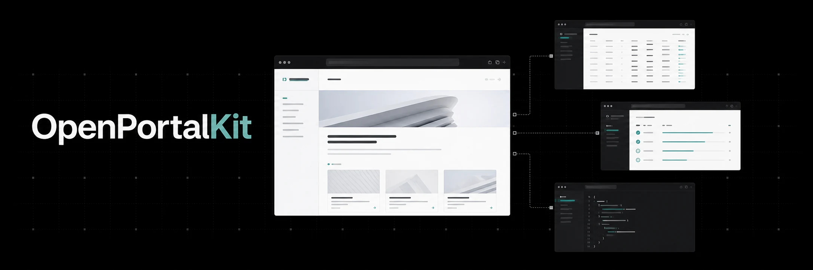

# OpenPortalKit



[](https://github.com/gordonlu/openportalkit/actions/workflows/ci.yml)
[](LICENSE)
[](https://github.com/gordonlu/openportalkit/commits/main)

[](https://dotnet.microsoft.com/)
[](https://nextjs.org/)
[](https://www.typescriptlang.org/)
[](https://www.postgresql.org/)
[](https://nodejs.org/)
[](https://github.com/PowerShell/PowerShell)

OpenPortalKit is an open-source .NET and Next.js framework for enterprise public portals, content-heavy websites,
and traceable structured-data publishing. It provides an editorial AdminHost, read-safe public ApiHost, background
JobHost, five public Web profiles, AgentSEO outputs, and optional industry packs.

The framework is deliberately narrower than a general business platform. Core remains industry-neutral; it is not a
CRM, BI system, trading platform, low-code builder, BPM suite, or data warehouse. Finance, Technology, Education,
Entertainment, and future vertical concepts belong in `industry-packs/`.

## Prerequisites

- .NET 10 SDK
- PowerShell 7+
- Node.js 22+ and npm
- Docker Compose v2 with PostgreSQL 17 for durable development and integration tests
- Google Chrome or Chromium for Playwright UI tests

## Quick Start

Build the repository sequentially. The single MSBuild worker avoids concurrent output-file locks:

```bash
git clone https://github.com/gordonlu/openportalkit.git
cd openportalkit
dotnet restore OpenPortalKit.sln
dotnet build OpenPortalKit.sln -m:1
```

Start the public API and administrator application in separate terminals:

```bash
dotnet run --project src/OpenPortalKit.ApiHost --launch-profile http
dotnet run --project src/OpenPortalKit.AdminHost --launch-profile http
```

Open:

- ApiHost: `http://localhost:5051`
- AdminHost: `http://localhost:5152`
- OpenAPI: `http://localhost:5051/api/openapi.json`
- Agent discovery: `http://localhost:5051/llms.txt`

Run the public Web application in explicit demo mode:

```bash
cd apps/web
npm ci
npm run dev
```

Open `http://localhost:3000`. Demo mode uses versioned example fixtures and is intended for visual exploration only.

## Create a Portal Workspace

After building the solution, generate a customer-owned workspace instead of editing a release package in place:

```bash
./tools/opk new \
  --name "Atlas Public Portal" \
  --profile corporate \
  --output ../atlas-public-portal
```

Available profiles are `corporate`, `data`, `research`, `activity`, and `finance`. Customize the validated identity,
colors, navigation, footer, logo, favicon, and social image in `apps/web/src/lib/branding.json`; keep customer assets
under `apps/web/public/`. Validate them before source-level React/CSS work or publishing:

```bash
cd ../atlas-public-portal
./tools/opk branding validate --root .
```

Keep customer-specific work in the generated workspace or a deliberate fork.

## Durable Local Development

Start PostgreSQL and Redis:

```bash
cp docker/.env.example docker/.env
docker compose --env-file docker/.env -f docker/docker-compose.yml up -d
```

Set the standard PostgreSQL variables and apply every migration through the checksum-verified migration runner:

```bash
export PGHOST=127.0.0.1
export PGPORT=5432
export PGDATABASE=openportalkit
export PGUSER=openportalkit
export PGPASSWORD=openportalkit_dev
pwsh -NoProfile -File ./tools/invoke-postgres-migrations.ps1
```

If port `5432` is occupied, set `POSTGRES_PORT=15432` in `docker/.env` and use `PGPORT=15432`.

Enable the main PostgreSQL store with environment configuration when starting ApiHost or AdminHost:

```bash
export ConnectionStrings__Default='Host=127.0.0.1;Port=5432;Database=openportalkit;Username=openportalkit;Password=openportalkit_dev'
export OpenPortalKit__Persistence__PostgreSQL__Enabled=true
```

Run the public Web application against ApiHost:

```bash
cd apps/web
OPK_WEB_DATA_MODE=live \
OPK_API_BASE_URL=http://127.0.0.1:5051 \
OPK_PUBLIC_BASE_URL=http://localhost:3000 \
npm run dev
```

Live mode reads published content, pages, datasets, and search only. It never requests administrator credentials or
falls back to demo records when ApiHost is unavailable.

## Verify Changes

```bash
dotnet build OpenPortalKit.sln -m:1
pwsh -NoProfile -File ./tools/check-boundaries.ps1
pwsh -NoProfile -File ./tools/run-tests.ps1
```

In `apps/web`:

```bash
npm run lint
npm run build
PLAYWRIGHT_CHROME_PATH=/usr/bin/google-chrome npm run test:e2e
PLAYWRIGHT_CHROME_PATH=/usr/bin/google-chrome npm run test:e2e:live
```

Set `OPK_POSTGRES_INTEGRATION` to a dedicated PostgreSQL connection string to include isolated-schema integration
tests. Do not run multiple solution builds concurrently.

## Documentation

- [Development Guidelines](docs/development-guidelines.md): architecture, module, data, security, testing, and change workflow.
- [Customization and Deployment](docs/deployment.md): customer workspace, live configuration, Windows publishing, and operations.
- [Public Web Runtime](docs/r15-public-web-runtime.md): demo/live contracts, search proxy, metadata, and failure behavior.
- [Branding and Assets](docs/r15-branding-assets.md): versioned identity manifest, safe assets, fallbacks, and validation.
- [Production Hardening](docs/r11-production-hardening.md): authentication, cookies, rate limits, proxy trust, and secrets.
- [Compatibility Policy](docs/compatibility-policy.md): public API and artifact compatibility expectations.
- [Release Checklist](docs/release-checklist.md): repository, Windows, security, promotion, and rollback evidence.
- [Examples](examples/README.md): five runnable visual profiles.
- [Roadmap](roadmap.md): milestone history and remaining release work.

## Repository Layout

```text
apps/web/         Public Next.js runtime
src/              .NET hosts, kernel, and generic modules
industry-packs/   Optional vertical resources isolated from core
templates/        Customer workspace templates
db/               Versioned PostgreSQL migrations
docker/           Local PostgreSQL and Redis services
tests/            Unit, contract, host, and PostgreSQL integration tests
tools/            CLI, migration, backup, security, and boundary commands
docs/             Architecture, operations, and contributor guidance
```

OpenPortalKit is licensed under the [MIT License](LICENSE). Public-output-changing actions must remain audited, and all
structured records must preserve provenance and freshness metadata.
