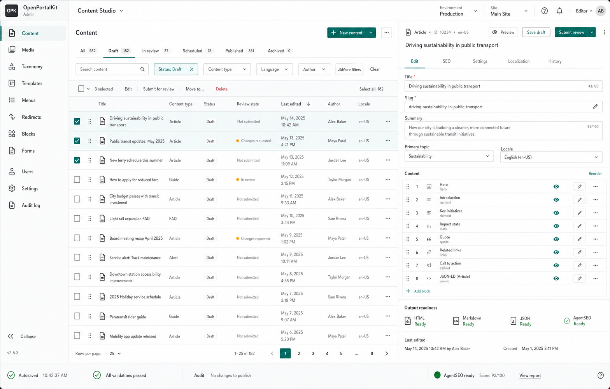

# R14 Admin Content Studio

## Product Goal

Turn the existing server-first AdminHost into a dependable daily publishing workspace. R14 keeps Razor Pages,
authentication, antiforgery, CSP, audit, workflow, and module contracts as the implementation boundary. It does not
introduce a second frontend runtime or a general low-code canvas.

The ImageGen concept is a visual-density and information-architecture reference, not executable UI or a source of
business rules. Final controls must use accessible HTML, real repository data, and existing service contracts.

## Experience Principles

- Optimize for scanning, filtering, editing, review, and repeated publication work.
- Keep content inventory and selected-item context visible together on wide screens; stack them on narrow screens.
- Replace raw configuration JSON with schema-driven fields while retaining an expert JSON fallback where necessary.
- Make draft, review, scheduled, published, and archived states unambiguous.
- Surface HTML, Markdown, JSON, sitemap, RSS, search, and AgentSEO readiness without decorative dashboard cards.
- Never imply that an action succeeded before its audited service operation completes.

## Delivery Batches

1. Shared admin shell, real navigation, responsive workspace structure, and consistent empty/error/loading states.
2. Content inventory with server-side filtering, pagination, selection, persistent version context, and traceability.
3. Structured block editor with permission-aware saves, validation, optimistic concurrency, recovery, and preview.
4. Review and publication workflow with comments, scheduling, output readiness, audit evidence, and browser tests.

## Delivery Status

- Batch 1 complete: shared navigation, responsive workspace structure, and consistent real-link behavior.
- Batch 2 complete: server-side inventory filtering, pagination, selection, PostgreSQL content persistence, immutable
  full-snapshot revisions, public visibility filtering, and traceability are implemented and tested.
- Batch 3 complete: schema-driven controls and typed structured lists, expert JSON fallback, explicit edit/publish
  policies, stable authenticated actor IDs, PostgreSQL-backed optimistic concurrency, conflict recovery, shared
  save/preview validation, and encoded server preview are implemented and browser-tested.
- Batch 4 complete: Portal Page drafts now move through review, approval, requested changes, rejection, scheduling,
  and publication in the editor. Review and publication commands are permission-gated; review comments are retained
  as immutable approval evidence; editing is locked outside draft/rejected states; stale transitions are rejected
  with atomic PostgreSQL optimistic concurrency.
- PostgreSQL workflow state, due schedules, and approval evidence are defined by `0017_publishing_workflow.sql`.
  JobHost polls due schedules through an industry-neutral workflow processor and publishes Portal Pages through
  `PortalPageService`, preserving page audit, outbox, cache invalidation, sitemap, RSS, and llms output behavior.
- Scheduled target failures remain due for retry. Successful targets transition once to `Published`; concurrent
  workers are resolved by the workflow store's state-and-timestamp compare-and-swap.
- Browser acceptance covers draft submission, commented approval, UTC scheduling, immediate publication, approval
  evidence, zero console errors, and zero horizontal overflow at 1440 px and 390 px widths.

## Operational Impact

JobHost must run with PostgreSQL persistence enabled for scheduled publication. Its
`OpenPortalKit:Jobs:ScheduledPublishing` section controls bounded batch size and polling interval. Failures are
reported in JobHost logs and remain retryable; no separate workflow dashboard card was added because the editor is
the owner of item-level state and the existing system-health surfaces remain the owner of background-job health.

Portal Page publication emits the existing `portal-page.published` outbox event. The existing revalidation planner
invalidates the public route, regenerates sitemap and RSS output, refreshes `llms.txt` and `llms-full.txt`, and warms
the published page. R14 does not introduce a second or unaudited publishing path.

## Boundaries

R14 does not create industry-specific content entities, a CRM, a general BPM engine, a drag-anything page builder,
or an unaudited remote publishing API. Data and asset authoring remain explicit follow-on integrations after the
content workflow is complete.

R14 publishes through ApiHost-compatible public contracts; it does not make the fixture-backed Next.js examples a
live CMS client. That public runtime integration, controlled branding/asset contract, and Windows customer handoff
are planned under R15 and documented in `deployment.md`.
